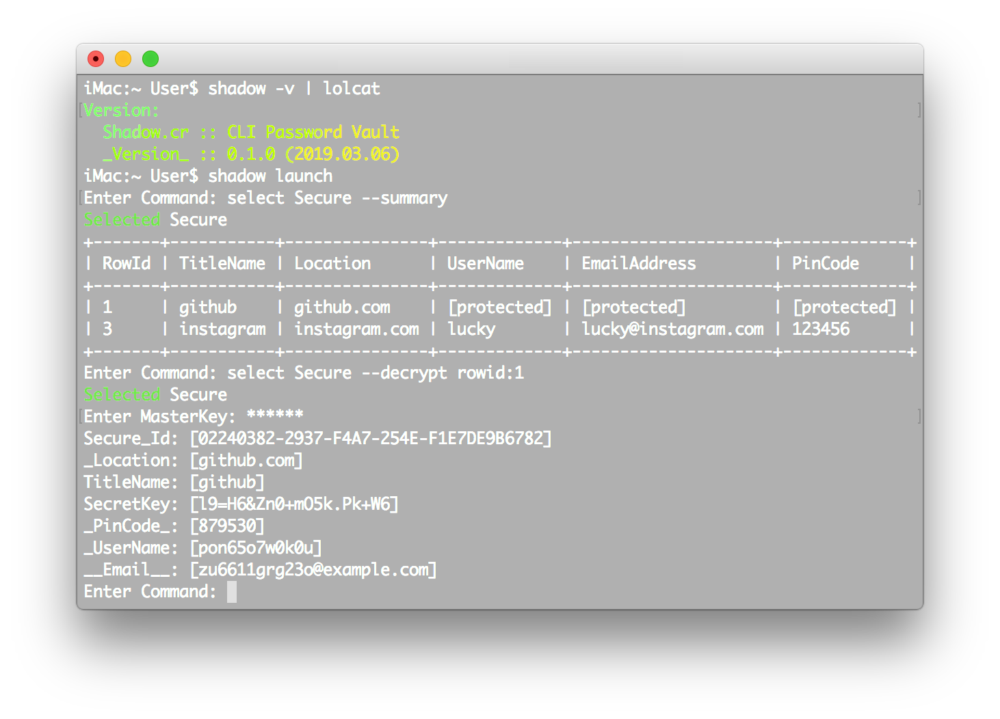

<div align = "center"></div>

<div align = "center">
  <h1>Shadow.cr - Concept Password Vault</h1>
</div>

<p align="center">
  <a href="https://crystal-lang.org">
    </a>
  <a href="https://travis-ci.org/636f7374/shadow.cr">
    </a>
  <a href="https://github.com/636f7374/shadow.cr/releases">
    </a>
  <a href="https://github.com/636f7374/shadow.cr/blob/master/license">
  	</a>
</p>

<div align = "center"><a href="https://asciinema.org/a/"></a></div>

## Description

* This is the second tool I made while learning the Crystal language. ( ≈ 1 year ago )
  * This is very different from my current idea, I will rewrite it in the future.
    * Wait for Shield.cr to rewrite the skeleton, source code.
    * Better CommandLine experience.
* In the future, once I have free time, I may rewrite it using Rust.
* Due to the need to maintain other Crystal repositories, this project will be temporarily put on hold.
  * **Currently, this repository is non-first priority, `2020-03-29 16:52:45.037714000 UTC`.**

### Summary

* Use [Shield.cr](https://github.com/636f7374/shield.cr) as the password generator.
* Shield generates [One-way security password.](https://en.wikipedia.org/wiki/One-way_compression_function)
* Shadow.cr that never saves any passwords.
* ...

### Features

* [X] Initialize / Destory / Rename / Bind / Move Database File.
* [X] Initialize / Destory Config File.
* [X] Create / Delete / Rename / Summary Tables.
* [X] Create / Delete / Search / Decrypt / Update Row Data.

### RoadMap

* [X] Sign the MasterKey with the Pbkdf2HMAC algorithm.
* [ ] More Design / Features / Stability Improvements.
* [ ] More Spec Tests / Code Comments / Wiki to be added.
* [ ] Shadow.cr Windows / Browser Extension / iOS Support.
* [ ] ...

## Use Shadow

### Used as Shard

Add this to your application's shard.yml:

```yaml
dependencies:
  shadow:
    github: 636f7374/shadow.cr
```

### Installation

```bash
$ git clone https://github.com/636f7374/shadow.cr.git
$ cd shadow.cr && make build && make install
```

## Development

```bash
$ make test
```

## Credit

* [\_Icon::categories/security](https://www.flaticon.com/packs/security-62)
* [Shard::faustinoaq/secrets](https://github.com/faustinoaq/secrets)
* [Shard::benoist/terminal_table.cr](https://github.com/benoist/terminal_table.cr)
* [Shard::crystal-lang/crystal-sqlite3](https://github.com/crystal-lang/crystal-sqlite3)

## Contributors

|Name|Creator|Maintainer|Contributor|
|:---:|:---:|:---:|:---:|
|**[636f7374](https://github.com/636f7374)**|√|√||

## License

* MIT License
